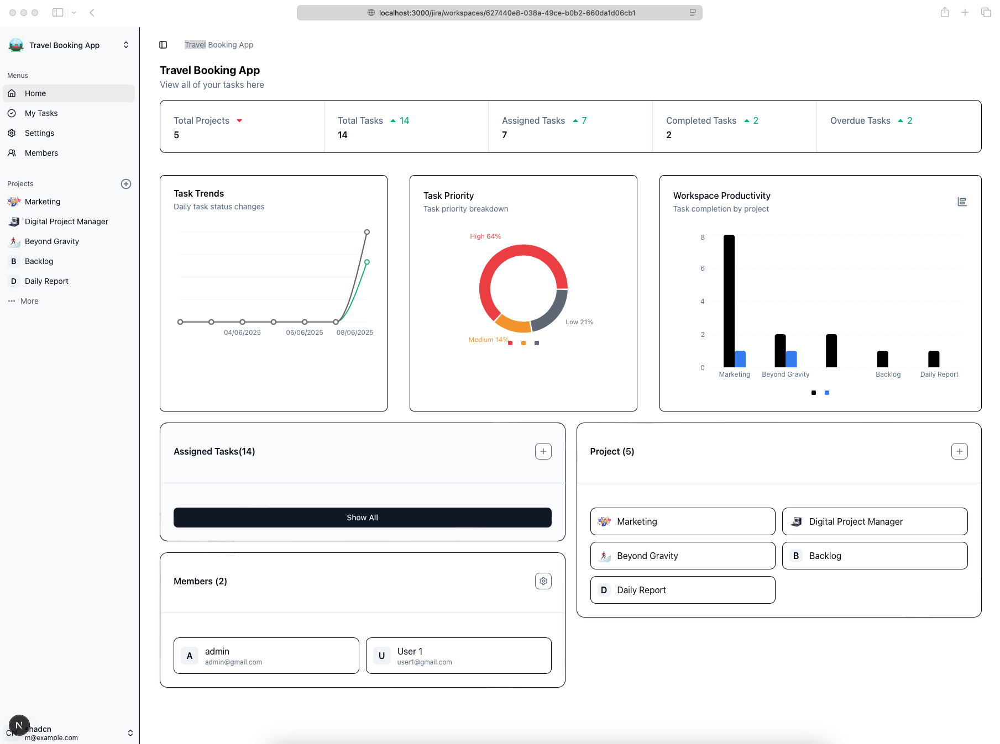
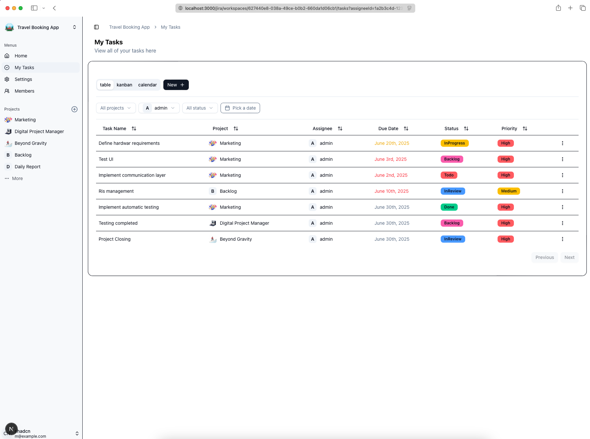
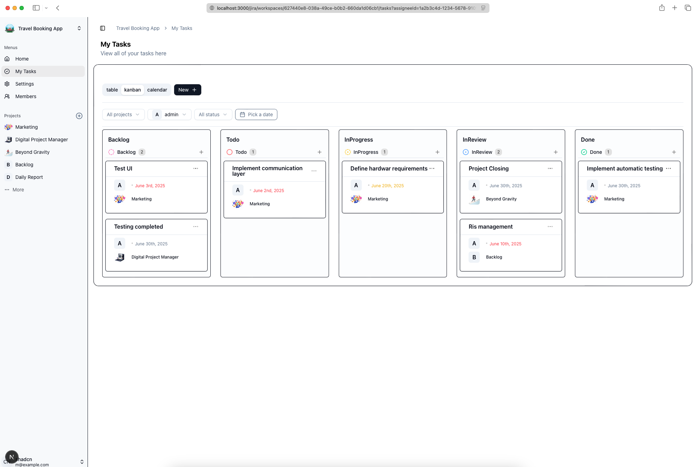
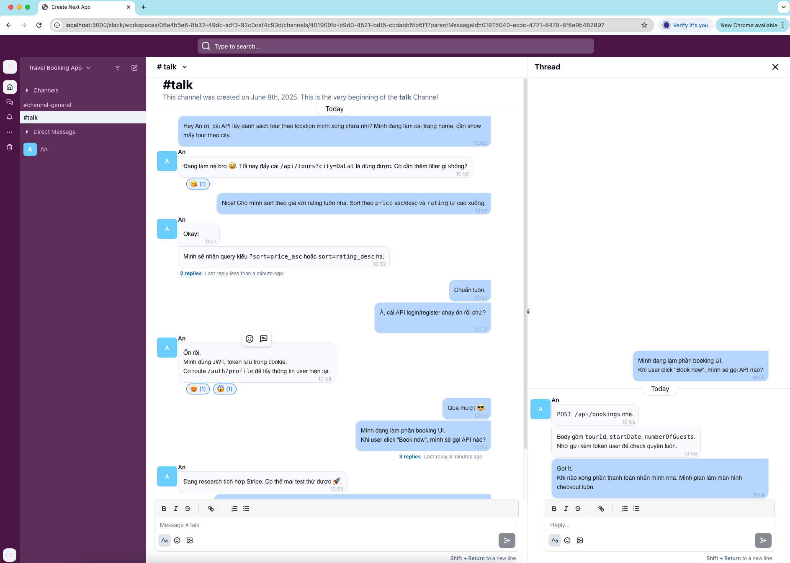
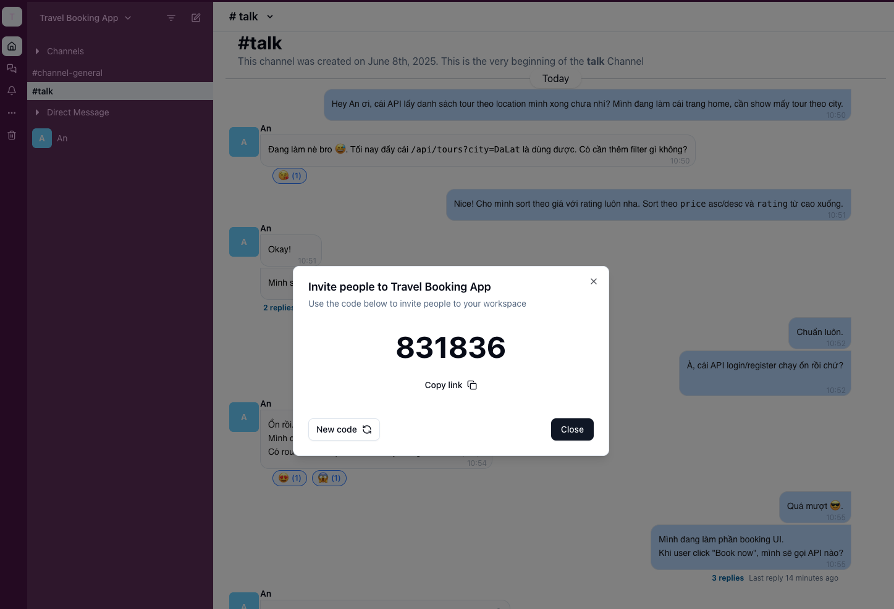

# Dev App - Fullstack Project

## Giới thiệu

Đây là một dự án fullstack mô phỏng hệ thống quản lý công việc, tài liệu, chat nhóm, và thương mại điện tử, mỗi ứng dụng được tách thành 1 hoặc nhiều module, được xây dựng với các công nghệ hiện đại:

## Tính năng nổi bật

**Backend**
- **Kiến trúc Modular Monolithic (Modulith):**
    -  Ứng dụng được phát triển như một đơn vị thống nhất, gắn kết nhưng được chia thành các mô-đun được xác định rõ ràng và liên kết lỏng lẻo
    -  Duy trì tính đơn giản của một khối cũng mang lại lợi ích về tính mô-đun thường gắn liền với các dịch vụ microservice
    -  Chia mã thành các mô-đun độc lập và mỗi mô-đun đóng gói các tính năng riêng cần thiết trong ứng dụng của bạn. (1 feature bao gồm: UI, Application, Domain, Infrastructure)
- **Vertical slice archirecture, DDD, CQRS:**
  - Tổ chức mã thành từng feature folders
  - CQRS phân tách trách trách nhiệm truy vấn chia các hoạt động thành commands (write) and queries (read)
- **Domain Driven Design - DDD:**
  - Entity, Aggregate, DomainEvent, Integration Event
  - **Rich-Domain Model Entity**: đóng gói logic nghiệp vụ trong các thực thể; Thiết kế phức tạp hơn so với 'Anemic Domain Model' nhưng tạo ra mô hình dễ duy trì và gắng kết hơn.
- **Database Schema Separation + Multi-Context EF Core DD Context:**
  - Cô lập các data của mỗi module vào bên trong các schema riêng biệt
  - Duy trì tính toàn vẹn và nhất quán của dữ liệu
  - Cân bằng tốt giữa tính cô lập và tính dễ quản lý (dễ hơn so với Separate database)
  - Thay đổi schema của 1 module không làm ảnh hưởng đến cá modules khác
- **Sử dụng các tính .Net Core chuyên sâu:**
  - JWT, RabbitMQ, logging, CORS, SignalR.
  - Áp dụng các pattern hiện đại:  CQRS, MediatR, DDD, Reponsitory, Unit of Work, **EF core Interceptor**, Seed Data, Outbox Pattern.

**Frontend**
- **Sử dụng các thư viện tốt nhất trong react**:
  - Typescript, Nextjs, Tanstack Query , Tailwind CSS, shadcn/ui, date-fns (làm việc với date), nuqs (quản lý trạng thái thông qua url), quản lý trạng thái Zustand, Jotai (vì cho mục đích học tập nên các công nghệ có cùng chức năng sẽ được áp dụng, nhưng code được splitting để không bao ngồm 2 thư viện Zustand và Jotail trong cùng 1 root router)
  - React hook form, zod
- **Vertical slice archirecture**
  - Tách biệt logic vào bên trong các react hook.
- Bao gồm Server Side Rendering và Client Side Rendering
- Tổ chức mã thành từng feature folders.
- **Bao gồm nhiều use-case thực tế**:
  - Xác thực với JWT (http only), xử lý refresh token.
  - Tự động retry với các request bị lỗi do access token hết hạn.
  - Ininite scroll, search, filtering
  - Chức năng auto save (với debounce)
  - Chức năng Undo / Redo
  - Với ứng dụng nhắn tin:
    - Cập nhật cache, state real-time thông qua kết nối socket
    - tự động scroll đến tin nhắn mới
    - tự động tải thêm dữ tin nhắn cũ khi scroll lên trên cùng.

---

- Module đăng nhập, xác thực JWT, refresh token
- Module quản lý dự án: server side render, kéo thả
- Module chat: Realtime với SignalR, thread chat, reactions, send image.
- Module tài liệu: cấu hình rich text editor như giống trình soạn thảo docs, chức năng cộng tác nhiều người chỉnh sửa trên cùng 1 tài liệu.
- Module thương mại điện tử: RabbitMq, out-box pattern.


## Hướng dẫn chạy thử

### Yêu cầu

- Docker & Docker Compose
- Node.js (>=18), pnpm/bun/yarn/npm
- .NET 8 SDK (nếu chạy backend riêng)

### Chạy phần backend bằng Docker

```sh
$> cd backend
$> docker-compose up --build
```

### Chạy phần frontend trên local


```sh
$> cd frontend
$> cp example.env
$> bun run build
$> bun run start
```


## Jira






---

## Slack




---

## Docs


